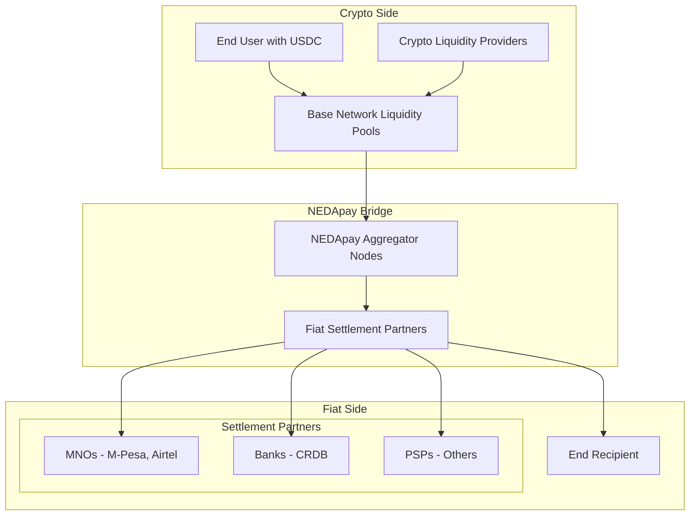

# NEDApay Architecture Analysis

## Current Understanding vs Reality Check

### Key Questions We Need to Answer:

1. **Who are the actual participants?**
   - Crypto liquidity providers (who?)
   - Fiat settlement partners (MNOs/Banks/PSPs)
   - End users
   - NEDApay aggregator nodes

2. **What does the transaction flow actually look like?**
   - User initiates payment
   - How does crypto get converted to fiat?
   - Who holds what at each step?
   - Where does the settlement happen?

3. **What are the API boundaries?**
   - APIs for crypto liquidity providers
   - APIs for fiat settlement partners  
   - APIs for end users/senders
   - Internal aggregator APIs

4. **Regulatory compliance model?**
   - How do traditional financial institutions participate without touching crypto?
   - What licenses does NEDApay need?
   - How is the crypto-fiat bridge legally structured?

## Proposed Architecture Diagram

## Critical Questions:

1. **Who exactly are the Crypto Liquidity Providers?**
   - Crypto exchanges?
   - DeFi protocols?
   - Individual crypto investors?
   - Market makers?

2. **How does NEDApay get fiat to pay settlement partners?**
   - Do they hold fiat reserves?
   - Do they convert crypto to fiat in real-time?
   - Do they have banking relationships?

3. **What's the legal structure?**
   - Is NEDApay a licensed money transmitter?
   - How do they comply with different country regulations?
   - What's the relationship with traditional financial institutions?

## Next Steps:
1. Validate this architecture understanding
2. Define clear participant roles
3. Map out API boundaries correctly
4. Fix documentation based on accurate architecture
